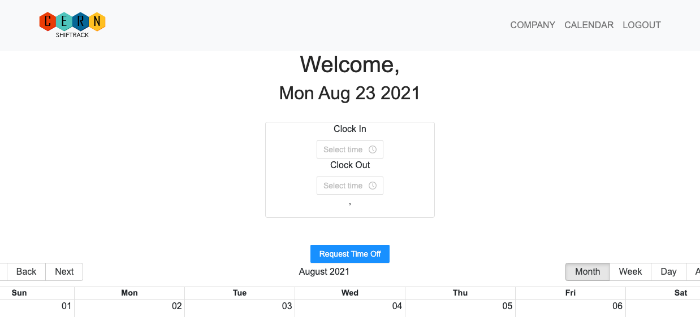
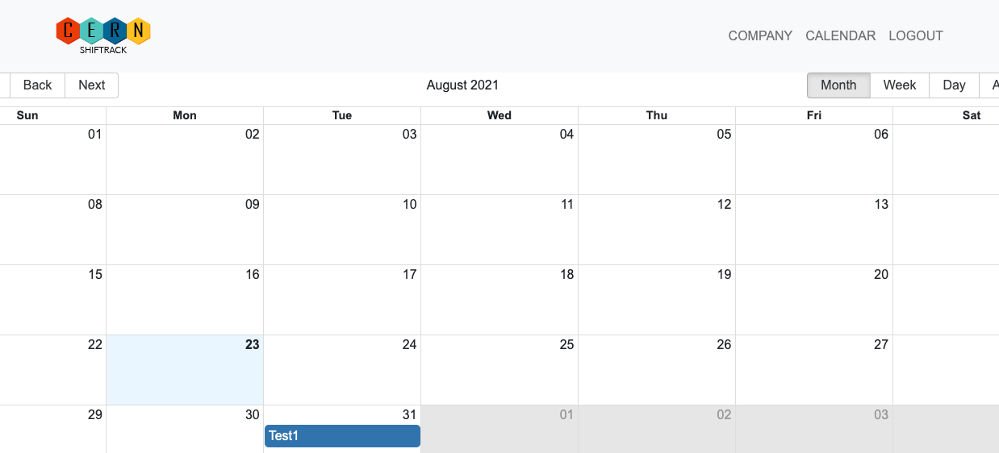

<p align="center">
  
</p>

<br>

# CERN_Shiftrack

Welcome to our employee time tracking app. With this app, employer can trach the employee's working hour and at the same time can make a schedule and post it. Besides that, employee can request time off and employer can make a schedule acordingly.

You can clone this repo.

git clone https://github.com/ElcinKoyuncu/CERN_Shiftrack.git

## Table of Contents
* [Installation](#installation)
* [Heroku Deployment](#heroku-deployment)
* [Video for the app](#video-for-the-app)
* [Screenshots](#screenshots)
* [For the future](#for-the-future)
* [Questions](#questions)

## Installation

```
nmp install 
nmp install express
nmp install mongoose
```

## Heroku Deployment

https://dry-anchorage-89160.herokuapp.com/

## Video for the app
​
Click [here](https://youtu.be/yBBKDqeg8ZM) for the video of the app.

## Screenshots

1-Login


2-Employee page


3-Request time off


4-Calendar



## For the future

- Account messaging
- Calendar rendition of clock-in/out
- Holiday alerts for employees with API
- COVID-19 Daily screening
- Include pay information for employees

## Questions
If you have any questions about this repo, you can open an issue, or contact us

ceyda_hergul@hotmail.com ||
15nate.jones@gmail.com ||
emilyfern121@gmail.com ||
elcinkoyuncu@gmail.com ||
rnl0396@gmail.com 

Pull requests are welcome